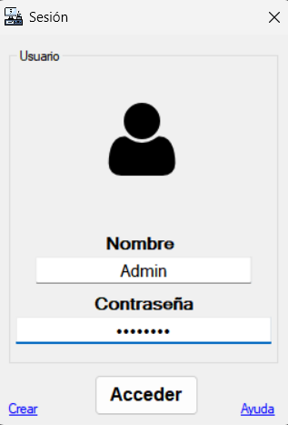
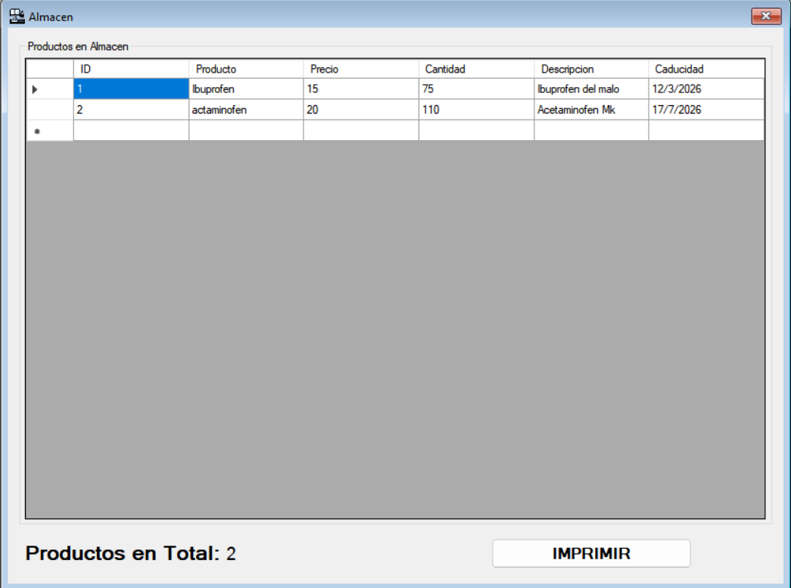
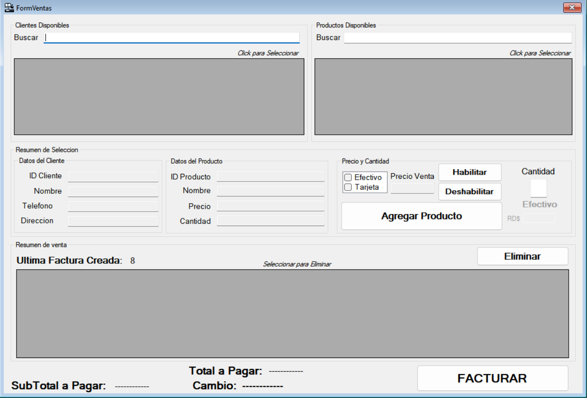

# 🛒 POS-400

> Sistema de Punto de Venta moderno diseñado para optimizar la gestión de ventas, inventario y clientes en pequeños y medianos negocios.

---

## 📖 Descripción

POS-400 es una aplicación desarrollada para facilitar las operaciones comerciales diarias mediante una interfaz intuitiva y funcionalidades enfocadas en la administración eficiente de productos, ventas e inventario.

El objetivo del proyecto es proporcionar una solución práctica, escalable y fácil de utilizar para negocios que requieren un sistema de gestión centralizado.

---

## ✨ Características Principales

### 🛍️ Gestión de Ventas

* Registro rápido de ventas.
* Cálculo automático de subtotales y totales.
* Historial de transacciones.

### 📦 Gestión de Inventario

* Registro de productos.
* Actualización automática de existencias.
* Control de stock disponible.

### 👥 Gestión de Clientes

* Registro de clientes.
* Consulta de información.
* Historial de compras.

### 📊 Reportes y Seguimiento

* Monitoreo de ventas.
* Estadísticas comerciales.
* Información para la toma de decisiones.

---

## 🖼️ Capturas de Pantalla

### 🏠 Login



### 📦 Gestión de Productos



### 💰 Módulo de Ventas



---

## 🛠️ Tecnologías Utilizadas

| Tecnología             | Descripción             |
| ---------------------- | ----------------------- |
| 💻 C#                  | Lenguaje principal      |
| ⚙️ .NET                | Framework de desarrollo |
| 🗄️ SQL Server         | Base de datos           |
| 🖥️ Visual Studio 2022 | Entorno de desarrollo   |
| 🔄 Git                 | Control de versiones    |
| 🌐 GitHub              | Gestión del repositorio |

---

## 🚀 Instalación

### 1️⃣ Clonar el repositorio

```bash
git clone https://github.com/Ener25/POS-400.git
```

### 2️⃣ Abrir el proyecto

Abrir la solución desde Visual Studio 2022.

### 3️⃣ Restaurar dependencias

Restaurar automáticamente los paquetes NuGet requeridos.

### 4️⃣ Ejecutar la aplicación

Compilar y ejecutar el proyecto.

---

## 📂 Estructura del Proyecto

```text
POS-400
│
├── 📁 Models
├── 📁 Views
├── 📁 Controllers
├── 📁 Services
├── 📁 Database
├── 📁 Assets
└── 📁 Documentation
```

---

## 🎯 Funcionalidades Futuras

* 📈 Dashboard con métricas avanzadas.
* 👤 Gestión de usuarios y roles.
* 🧾 Facturación electrónica.
* 📤 Exportación de reportes PDF y Excel.
* 🔍 Búsqueda avanzada de productos.
* 📱 Adaptación para dispositivos móviles.

---

## 👨‍💻 Autor

### Ener Jesus Debol

🎓 Ingeniero en Sistemas Computacionales

💡 Apasionado por el desarrollo de software, aplicaciones empresariales y soluciones tecnológicas innovadoras.

📌 Este proyecto forma parte de mi portafolio profesional de desarrollo de software.

---

## ⭐ Apoya el Proyecto

Si este proyecto te resulta interesante, considera darle una ⭐ al repositorio.

¡Gracias por visitar POS-400!
